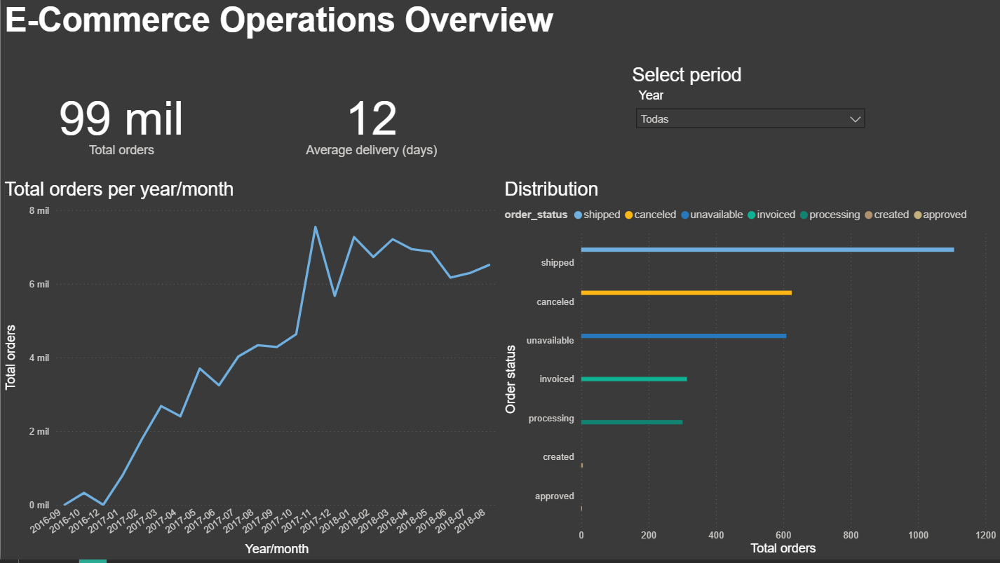

# Serverless E-Commerce Data Lakehouse & BI Dashboard

## 📌 Project Overview
This repository contains an end-to-end Data Engineering and Analytics project designed to process, analyze, and visualize the Brazilian E-Commerce Public Dataset by Olist. The architecture is built entirely on AWS using a **Serverless** and **FinOps** (cost-optimized) approach, ensuring high performance with near-zero operational costs, and capped off with an interactive Power BI dashboard.

## 🏗️ Architecture
The pipeline follows a modern Data Lakehouse medallion architecture (Raw -> Clean -> Business):
1. **Ingestion:** Raw CSV data is extracted via local Python scripts and ingested into an Amazon S3 Landing Zone (Bronze).
2. **Transformation:** S3 events trigger AWS Lambda functions (using AWS SDK for Pandas / Data Wrangler) to clean, cast data types, and convert files to Parquet format (Silver/Gold).
3. **Warehousing:** The optimized Parquet files are queried directly via Amazon Athena (Serverless SQL).
4. **Visualization:** Power BI connects directly to Athena via ODBC using **DirectQuery**, enabling real-time interactive dashboards without importing data locally.
5. **Orchestration & IaC:** (WIP) AWS Step Functions to manage the ETL state machine and Terraform for infrastructure provisioning.

## 📊 Interactive Dashboard
The final layer of the project is a business-facing dashboard built to track logistics and sales performance. 

*Below is a static preview of the dashboard querying the AWS Data Lake in real-time:*

## 🛠️ Tech Stack
* **Cloud Provider:** AWS (S3, Lambda, Athena, IAM)
* **Language:** Python 3.x (boto3, pandas, awswrangler)
* **Data Processing:** Serverless ETL (AWS Lambda)
* **Data Warehouse / Analytics:** Amazon Athena (Presto SQL)
* **Business Intelligence:** Power BI (DAX, DirectQuery, Athena ODBC)
* **Infrastructure / DevOps:** Git, GitHub, Terraform (WIP)

## 📂 Repository Structure
* `infrastructure/`: Terraform configuration files to deploy AWS resources.
* `src/`: Python source code for data extraction and Lambda transformation logic.
* `sql/`: DDL scripts for defining Athena external tables.
* `docs/`: Project documentation, architecture diagrams, and BI resources (including the `.pbix` file and images).

---
**Author:** Javier E. Dlogokiski, Data Science Technician.